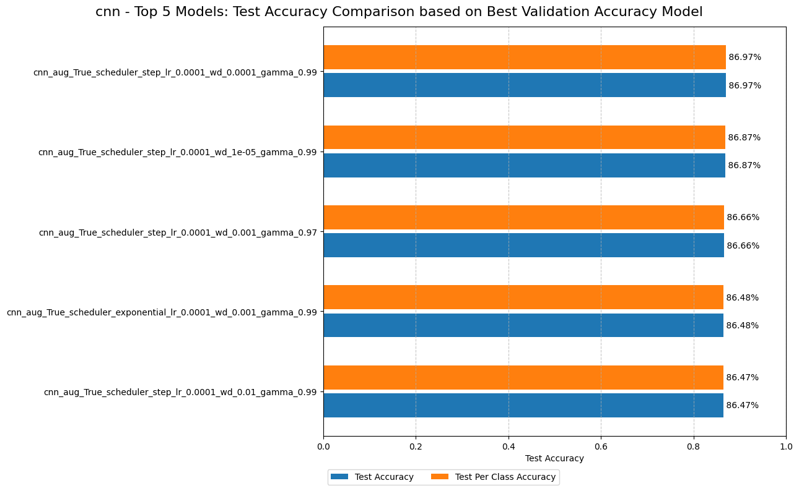
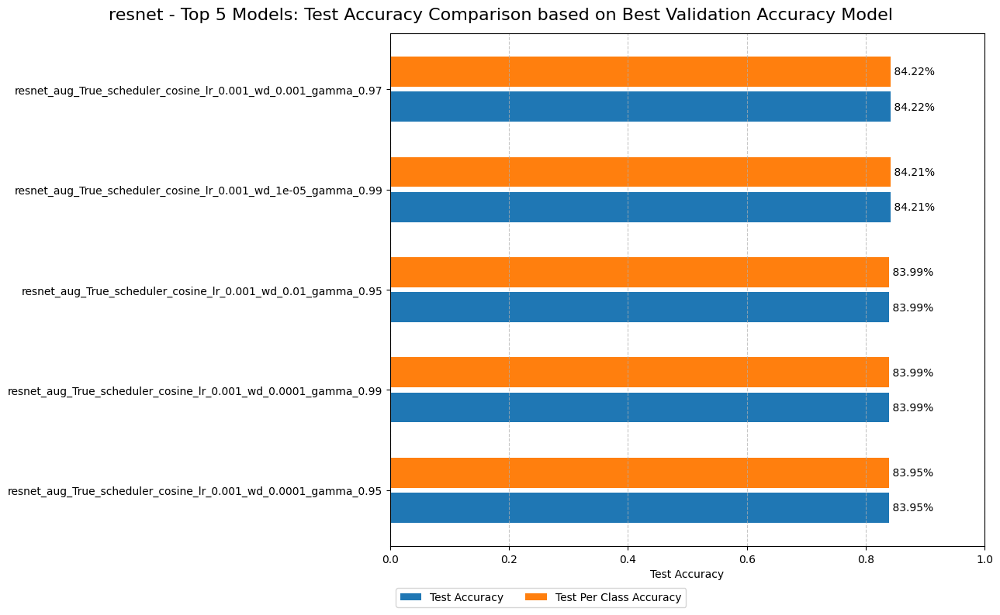
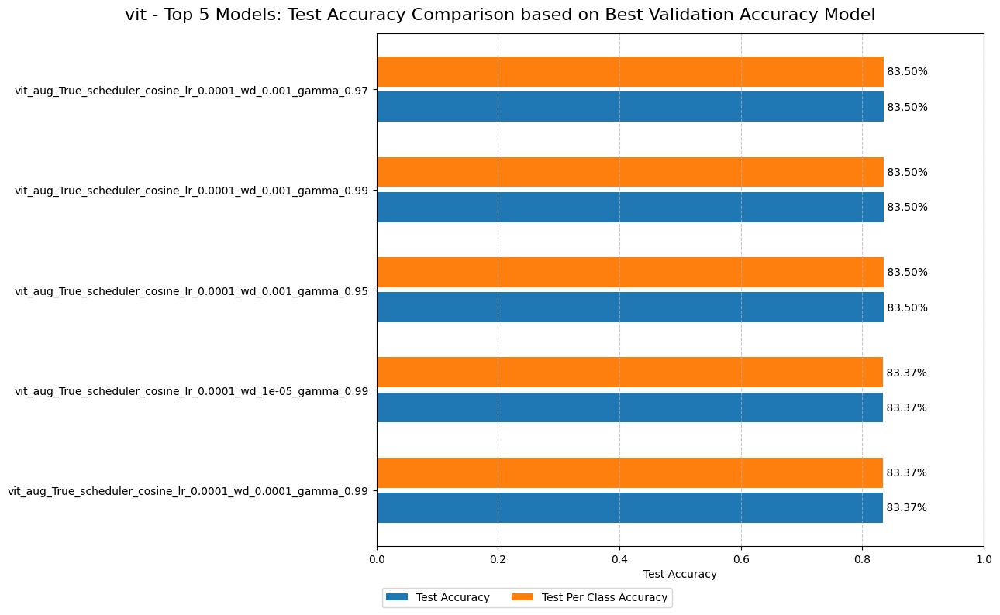
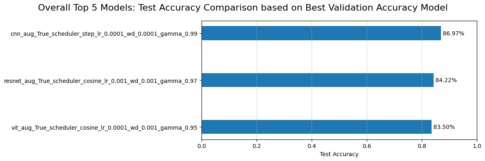

<a name="readme-top"></a>

<!-- PROJECT LOGO -->
<div align="center">
  <h1 align="center">CIFAR 10 Classification Project</h1>
  <p align="center">
    Image classification on the CIFAR-10 dataset using VGG, ResNet, and a custom CNN, with balanced data handling and augmentation techniques.
    <br />
    ·
    <a href="https://github.com/eliasmarcon/CIFAR-10/issues">Report Bug</a>
    ·
    <a href="https://github.com/eliasmarcon/CIFAR-10/issues">Request Feature</a>
  </p>
</div>

<!-- TABLE OF CONTENTS -->
<details>
  <summary>Table of Contents</summary>
  <ol>
    <li><a href="#installation">Requirements</a></li>
      <ol>
          <li><a href="#using-python-with-requirementstxt">Using Python with requirements txt file</a></li>
          <li><a href="#using-conda-on-a-slurm-cluster">Using Conda on a SLURM Cluster</a></li>
      </ol>
    <li><a href="#dataset">Dataset</a></li>
      <ol>
        <li><a href="#data-augmentation">Data Augmentation</a></li>
      </ol>
    <li><a href="#file-structure">File Structure</a></li>
    <li><a href="#model-architectures">Model Architectures</a></li>
      <ol>
        <li><a href="#cnnbasic">CNNBasic</a></li>
        <li><a href="#resnet">ResNet</a></li>
        <li><a href="#vit-vision-transformer">ViT (Vision Transformer)</a></li>
      </ol>
    <li><a href="#training">Training</a></li>
      <ol>
        <li><a href="#locally">Locally</a></li>
        <li><a href="#slurm-cluster">Slurm Cluster</a></li>
        <li><a href="#tracking--logging">Tracking / Logging</a></li> 
      </ol>
    <li><a href="#testing-results">Testing Results</a></li>
      <ol>
        <li><a href="#results-cnn">Results CNN</a></li>
        <li><a href="#results-resnet">Results ResNet</a></li>
        <li><a href="#results-vit">Results ViT</a></li>
      </ol>
    <li><a href="#overall-results">Overall Results</a></li>
  </ol>
</details>

<br>

# Requirements

Before running the code locally or on a SLURM cluster, please ensure the necessary dependencies are installed. For detailed instructions on setting up the environment look at the sections below. In order to run the code and created models, refer to the [Training & Testing](#training--testing) section.

## Using Python with requirements.txt

1. **Local Environment:**

   - Ensure Python (>=3.10) and pip are installed.

   - Clone the repository:

     ```bash
     git clone <repository_url>
     cd <repository_name>
     ```

   - Install dependencies from `requirements.txt`:
     ```bash
     pip install -r requirements.txt
     ```

## Using Conda on a SLURM Cluster

1. **Setting Up Conda Environment:**

   - Connect to the SLURM cluster.

   - Install all requirements and other dependencies:

     ```bash
        sbatch slurm_cluster/setup_conda.sh
     ```

   - Ensure all provided data dependencies are available and accessible within your environment.

2. **Running the Code:**

   - in the `./slurm_cluster/run_cluster.sh` and `./slurm_cluster/run_cluster_sets.sh` file the created conda environment is activated, used and then after the job is done, deactivated.

<p align="right">(<a href="#readme-top">back to top</a>)</p>

# Dataset

The CIFAR-10 dataset is a widely-used benchmark in machine learning and computer vision. It consists of 60,000 32x32 color images divided into 10 classes, with each class containing 6,000 images. The dataset is split into 50,000 training images and 10,000 test images. The ten classes are: `Airplanes`, `Automobiles`, `Birds`, `Cats`, `Deer`, `Dogs`, `Frogs`, `Horses`, `Ships`, and `Trucks`. CIFAR-10 is commonly used for evaluating image classification algorithms due to its diverse range of objects and relatively small image size.

<p align="right">(<a href="#readme-top">back to top</a>)</p>

## Data Augmentation

For experiments involving data augmentation, the following transformations are applied to the CIFAR-10 dataset to enhance model robustness and generalization:

- `Horizontal Flip`: Randomly flips images horizontally with a probability of 50%, helping the model learn invariance to horizontal changes.
- `Rotation`: Rotates images by a random angle within a 15-degree range, improving the model's ability to handle rotated versions of objects.
- `Random Crop`: Crops images to 32x32 pixels with a 4-pixel padding, creating variations in the image content and introducing slight positional changes.

These augmentations are applied during the training phase to artificially expand the dataset and improve the performance of the model on unseen data. The code for the augmentations can be found in the `./src/dataset/utils_dataset.py` file.

<p align="right">(<a href="#readme-top">back to top</a>)</p>


# File Structure

The file structure of this repository is designed to keep things organized and accessible, allowing for easy navigation and efficient project management.

```
├── cifar-10/                 # Contains all files related to the CIFAR-10 dataset.
│   
├── hyperparameter_sets/      # Stores configurations for different sets of hyperparameters used in experiments.
│   
├── saved_models/             # Includes files for models that have been trained and saved.
│   
├── slurm_cluster/            # Contains scripts for managing and running jobs on a SLURM cluster.
│   ├── setup_conda.sh        # Script to set up Conda environment on the cluster.
│   ├── run_cluster.sh        # Script to execute jobs on the cluster.
│   ├── run_cluster_sets.sh   # Script for running multiple job sets (one hyperparameter file) on the cluster.
│
├── src/                      # Source code for the project.
│   ├── dataset/              # Contains code for dataset creation and manipulation.
│   ├── logger/               # Includes logging utilities for tracking experiments.
│   ├── metrics/              # Contains code for evaluating model performance.
│   ├── models/               # Includes model architecture definitions.
│   ├── trainer_tester/       # Contains training and testing logic.
│   └── main.py               # The main entry point for executing the code.
│
├── clean_runs.csv            # Log of runs and results
```

<p align="right">(<a href="#readme-top">back to top</a>)</p>


# Model Architectures

This repository includes several model architectures implemented for image classification tasks. Below are brief descriptions of each model.

## CNNBasic

`CNNBasic` is a straightforward convolutional neural network designed for image classification. It features:

- **Convolutional Layers**: Three convolutional blocks with increasing complexity, each block containing two convolutional layers followed by batch normalization and GELU activation.
- **Activation Function**: GELU (Gaussian Error Linear Unit) is used for nonlinear transformations.
- **Regularization**: Dropout layers are included to mitigate overfitting.
- **Output Layer**: The final classification is performed using a softmax layer to output probabilities for the 10 CIFAR-10 classes.

### Key Components:

- **Convolutional Blocks**: 48, 96, 192, 256, and 512 channels in consecutive layers.
- **Pooling**: Max pooling layers to reduce spatial dimensions.
- **Fully Connected Layers**: Four dense layers with dropout in between.

<p align="right">(<a href="#readme-top">back to top</a>)</p>

## ResNet

`ResNet` (Residual Network) leverages residual connections to train deeper networks. This architecture is characterized by:

- **Residual Blocks**: Blocks with skip connections that add the input to the output, addressing the vanishing gradient problem and enabling deeper networks.
- **Initial Convolutional Layer**: A 7x7 convolution followed by batch normalization and ReLU activation.
- **Pooling**: Max pooling layer to reduce dimensionality.
- **Final Layers**: Adaptive average pooling followed by a fully connected layer for classification.

### Key Components:

- **Residual Connections**: Shortcut paths that skip one or more layers.
- **Convolutional Layers**: Includes multiple convolutional and batch normalization layers.
- **Pooling**: Adaptive average pooling to handle input size variability.

<p align="right">(<a href="#readme-top">back to top</a>)</p>

## ViT (Vision Transformer)

`ViT` (Vision Transformer) applies transformer models to image classification. It processes images as sequences of patches:

- **Patch Embedding**: The image is divided into patches, each converted into a sequence of tokens.
- **Transformer Layers**: Multiple layers of multi-head self-attention and feedforward networks.
- **Positional Encoding**: Sincos positional embeddings are used to retain spatial information.
- **Output Layer**: A linear layer predicts class probabilities from the transformed image patches.

### Key Components:

- **Patch Embedding**: Converts image patches into feature vectors.
- **Attention Mechanism**: Multi-head self-attention for capturing relationships between patches.
- **Feedforward Network**: Applies nonlinear transformations to attention outputs.
- **Final Classification**: Linear layer outputs predictions for the 10 CIFAR-10 classes.

<br>

For more detailed information, refer to the source code located in the `./src/models/` directory. Each architecture is implemented as a class that extends the `BaseModel` from `models.parent_class_models`.

<p align="right">(<a href="#readme-top">back to top</a>)</p>


# Training

To optimize the training of deep learning models, a comprehensive exploration of various hyperparameter combinations was conducted. Below is a summary of the hyperparameters tested:

| Hyperparameter    | Values |
| ----------------- | -------------------------------------- | 
| Model             | [`ResNet`, `CNNBasic`, `ViT`]          | 
| Learning Rate     | [`0.01`, `0.001`, `0.0001`, `0.00001`] | 
| Weight Decay      | [`0.01`, `0.001`, `0.0001`, `0.00001`] | 
| Gamma             | [`0.95`, `0.97`, `0.99`]               | 
| Scheduler         | [`Exponential`, `Step`, `Cosine`]      | 
| Data Augmentation | [`False`, `True`]                      | 


These hyperparameters result in the training of `864 models`. The models can be trained either locally (with the normal `./src/main.py` file) or on a Slurm cluster using specific scripts: `./slurm_cluster/run_cluster.sh` and `./slurm_cluster/run_cluster_sets.sh`.

<p align="right">(<a href="#readme-top">back to top</a>)</p>


## Locally

To run experiments locally, use the following command format:

```bash
# General Arguments
python src/main.py -d [DATASET_PATH] 
                   -e [EPOCHS] 
                   -b [BATCH_SIZE] 
                   -m [MODEL] 
                   -s [SCHEDULER] 
                   -a [DATA_AUGMENTATION] 
                   -l [LEARNING_RATE] 
                   -w [WEIGHT_DECAY] 
                   -g [GAMMA] 
                   -f [VALIDATION_FREQUENCY] 
                   -p [EARLY_STOPPING]

# Example
python src/main.py -d ./cifar-10 -e 50 -b 64 -m resnet -s step -a -l 0.001 -w 0.0001 -g 0.97 -f 5 -p 10
```

Breakdown of the Command:

| Argument | Value      | Description                                       |
|----------|------------|---------------------------------------------------|
| `-d`      | `./cifar-10` | Sets the path to the dataset to `./cifar-10`.   |
| `-e`      | `50`       | Sets the number of epochs to `50`.               |
| `-b`      | `64`       | Defines the batch size as `64`.                  |
| `-m`      | `resnet`   | Specifies the model type as `resnet`.            |
| `-s`      | `step`     | Uses a step scheduler for the learning rate.     |
| `-a`      | `(TRUE)`     | Enables data augmentation.                       |
| `-l`      | `0.001`    | Sets the learning rate to `0.001`.               |
| `-w`      | `0.0001`   | Specifies the weight decay as `0.0001`.          |
| `-g`      | `0.97`     | Sets the gamma value for the learning rate scheduler to `0.97`. |
| `-f`      | `5`        | Sets the validation frequency to `5`.            |
| `-p`      | `10`       | Sets the early stopping patience to `10`.        |

<p align="right">(<a href="#readme-top">back to top</a>)</p>


## Slurm Cluster

To run experiments on a Slurm Cluster, use the following command format:

```bash
# General Arguments
sbatch run_cluster.sh [EPOCHS] [BATCH_SIZE] [MODEL] [SCHEDULER] [DATA_AUGMENTATION] [LEARNING_RATE] [WEIGHT_DECAY] [GAMMA]

# Example
sbatch run_cluster.sh 50 64 resnet step True 0.001 0.0001 0.97

# General Arguments
sbatch run_cluster_sets.sh [HYPERPARAMETER_SET_NUMBER]

# Example
sbatch run_cluster_sets.sh 7
```

`./slurm_cluster/run_cluster.sh`: This script allows testing of individual custom hyperparameters. It's suitable for running a single experiment with user-defined settings.

`./slurm_cluster/run_cluster_sets.sh`: This script takes an input file number as an argument (`hyperparameter_file_number`) and runs a predefined set of hyperparameters. The hyperparameter set is fetched from a specific file located at `hyperparameter_sets/hyperparameters_{filenumber}.txt`. This approach enables systematic testing of multiple hyperparameter combinations in batch mode on the Slurm cluster.

<p align="right">(<a href="#readme-top">back to top</a>)</p>


## Tracking / Logging

Metrics and model training details are logged using the Weights and Biases (wandb) platform. Weights and Biases provides a suite of tools for experiment tracking, including real-time visualization of metrics, model performance, and system metrics. For more details on setting up and using wandb, refer to the [Weights and Biases documentation](https://docs.wandb.ai/?_gl=1*sm4dkz*_ga*MTAxNzQ1OTkzMS4xNzEzNzA0NzUx*_ga_JH1SJHJQXJ*MTcyMDY4ODM2My43OS4xLjE3MjA2ODg4OTUuNDcuMC4w).

<p align="right">(<a href="#readme-top">back to top</a>)</p>


# Testing Results

This section details the various model groups and their corresponding instance counts used within the project repository. The categorization aims to provide insights into the scale and distribution of experiments and model training runs. All results for the runs in this section are in the `clean_runs.csv` file and the model weights for the resnet and cnn are in the `saved_models` folder (except the ViT because the weights are too big). The following table shows each model and their instance count.

| Group           | Instance Count |
| --------------- | -------------- |
| CNN      | 288            |
| ResNet   | 288            |
| ViT      | 288            |
| Total    | 864            |

<p align="right">(<a href="#readme-top">back to top</a>)</p>


### Results CNN

The graph illustrates the performance of the top 5 CNN models, comparing their Test Accuracy and Test Per Class Accuracy.



Here are the key observations:

- `Top Performing Models`: The best performing model is `cnn_aug_True_scheduler_step_lr_0.0001_wd_0.0001_gamma_0.99`, achieving both the highest Test Accuracy and Test Per Class Accuracy at 86.97%.
- `Consistency`: For all models shown, the Test Accuracy and Test Per Class Accuracy are identical, indicating consistent performance across all classes.
- `Performance Range`: The Test Accuracy for the top 5 models ranges from 86.47% to 86.97%, showing high and consistent performance across different hyperparameter configurations.

- `Hyperparameter Influence`:

  - All top models use data augmentation (aug_True).
  - Learning rates are consistently 0.0001 across the top models.
  - Weight decay values vary from 1e-05 to 0.01.
  - The gamma values range from 0.97 to 0.99, with 0.99 being most common.

- `Scheduler Types`: Most models use a step learning rate scheduler, with one model using an exponential scheduler.
- `Marginal Improvements`: The performance difference between the best and fifth-best model is only 0.5%, indicating that the CNN architecture is robust across various hyperparameter settings.
- `Augmentation Benefit`: All top models use data augmentation, suggesting its effectiveness in improving model performance.

These results demonstrate that the CNN architecture, when using data augmentation and appropriate learning rate scheduling, achieves good performance (above 86%) on this task. The high accuracy across all top models suggests that this CNN implementation is well-suited for the classification task at hand. The slight variations in performance due to different weight decay and gamma values highlight the importance of fine-tuning these hyperparameters.

<p align="right">(<a href="#readme-top">back to top</a>)</p>


### Results ResNet

The graph illustrates the performance of the top 5 ResNet models, comparing their Test Accuracy and Test Per Class Accuracy.



- `Top Performing Models`: The best performing model is `resnet_aug_True_scheduler_cosine_lr_0.001_wd_0.001_gamma_0.97`, achieving both the highest Test Accuracy and Test Per Class Accuracy at 84.22%.
- `Consistency`: For all models shown, the Test Accuracy and Test Per Class Accuracy are identical, indicating consistent performance across all classes.
- `Performance Range`: The Test Accuracy for the top 5 models ranges from 83.95% to 84.22%, demonstrating high and consistent performance across different hyperparameter configurations.

- `Hyperparameter Influence`:

  - All top models use data augmentation (aug_True).
  - All models use a cosine learning rate scheduler.
  - The learning rate is consistently 0.001 across all top models.
  - Weight decay values vary from 1e-05 to 0.01.
  - The gamma values range from 0.95 to 0.99.


- `Cosine Scheduler`: The consistent use of cosine learning rate scheduler across all top models suggests it works well with ResNet for this task.
- `Optimal Weight Decay`: The top two models use weight decay values of 0.001 and 1e-05, respectively, suggesting that a moderate to low weight decay might be beneficial.
- `Marginal Improvements`: The performance difference between the best and fifth-best model is only 0.27%, indicating that the ResNet architecture is robust across various hyperparameter settings.
- `Augmentation Benefit`: All top models use data augmentation, suggesting its effectiveness in improving model performance.

These results demonstrate that the ResNet architecture, when using data augmentation and cosine learning rate scheduling, achieves good performance (above 83%) on this task. The high accuracy across all top models suggests that this ResNet implementation is well-suited for the classification task at hand. The slight variations in performance due to different weight decay and gamma values highlight the importance of fine-tuning these hyperparameters, even with a robust architecture like ResNet.

<p align="right">(<a href="#readme-top">back to top</a>)</p>


### Results ViT

The graph illustrates the performance of the top 5 ViT models, comparing their Test Accuracy and Test Per Class Accuracy.



- `Top Performing Models`: The top three models all achieve the same highest Test Accuracy and Test Per Class Accuracy of 83.50%.
- `Consistency`: For all models shown, the Test Accuracy and Test Per Class Accuracy are identical, indicating consistent performance across all classes.
- `Performance Range`: The Test Accuracy for the top 5 models ranges from 83.37% to 83.50%, demonstrating very consistent performance across different hyperparameter configurations.

- `Hyperparameter Influence`:

  - All top models use data augmentation (aug_True).
  - All models use a cosine learning rate scheduler.
  - The learning rate is consistently 0.0001 across all top models.
  - Weight decay values are mostly 0.001, with variations of 1e-05 and 0.0001 in the lower-performing models.
  - The gamma values range from 0.95 to 0.99.


- `Cosine Scheduler`: The consistent use of cosine learning rate scheduler across all top models suggests it works well with ViT for this task.
- `Optimal Weight Decay`: The top three models all use a weight decay of 0.001, suggesting this might be an optimal value for this architecture and task.
- `Gamma Value Impact`: The top models use gamma values of 0.97, 0.99, and 0.95, indicating that the model is somewhat robust to changes in this parameter within this range.
- `Marginal Improvements`: The performance difference between the best and fifth-best model is only 0.13%, indicating that the ViT architecture is extremely robust across various hyperparameter settings.
- `Augmentation Benefit`: All top models use data augmentation, suggesting its effectiveness in improving model performance.

These results demonstrate that the Vision Transformer architecture, when using data augmentation and cosine learning rate scheduling, achieves good and highly consistent performance (around 83.5%) on this task. The minimal variation in performance across different hyperparameter settings suggests that ViT is particularly robust and less sensitive to small changes in these parameters. The consistency in performance also indicates that the model is likely well-suited for the classification task at hand, providing reliable results across different configurations.

<p align="right">(<a href="#readme-top">back to top</a>)</p>


## Overall Results

This graph compares the test accuracy of the top 3 models across different architectures based on their best validation accuracy.



Here's an interpretation of the overall results:

- `Best Performing Model`: The CNN model with data augmentation, step scheduler, learning rate of 0.0001, weight decay of 0.0001, and gamma of 0.99 achieves the highest test accuracy at 86.97%.

- `Model Ranking`:

  - CNN: 86.97%
  - ResNet: 84.22%
  - Vision Transformer (ViT): 83.50%

- `Architecture Comparison`:

  - The CNN architecture outperforms both ResNet and ViT by a significant margin.
  - ResNet slightly edges out ViT, but the difference is relatively small (less than 1%).

- `Common Features`:

  - All top models use data augmentation (aug_True), indicating its importance across architectures.
  - All models use learning rate schedulers, though the type varies (step for CNN, cosine for ResNet and ViT).

- `Hyperparameter Patterns`:

  - Learning rates: CNN uses 0.0001, while ResNet uses a higher rate of 0.001.
  - Weight decay: Both CNN and ResNet use 0.001, suggesting this might be an optimal value.
  - Gamma values vary across models (0.99 for CNN, 0.97 for ResNet, 0.95 for ViT).


- `Performance Gap`: There's a noticeable performance gap between CNN and the other architectures, with CNN outperforming ResNet by about 2.75% and ViT by about 3.47%.

These results demonstrate that for this particular task, the CNN architecture emerges as the clear winner. The effectiveness of data augmentation is evident across all top models. The variation in learning rates and scheduler types between CNN and the other architectures suggests that different models benefit from different optimization strategies.
The significant performance advantage of CNN over more complex architectures like ResNet and ViT is noteworthy. This could indicate that the task doesn't necessarily benefit from deeper or more sophisticated models, and the relatively simpler CNN structure might be capturing the essential features more effectively.

<p align="right">(<a href="#readme-top">back to top</a>)</p>
